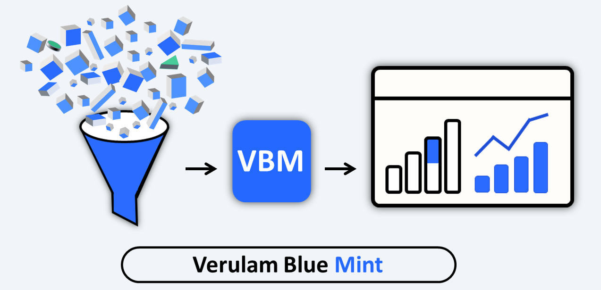
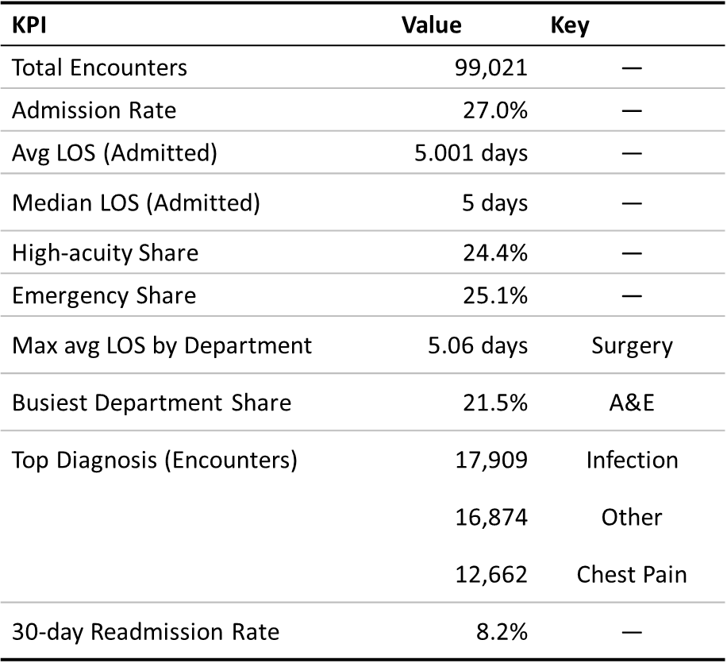
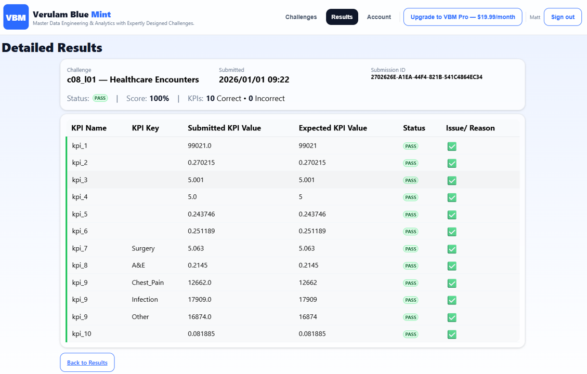

# Verulam Blue — Hospital Encounters SQL Data Cleaning Pipeline & KPIs

  

<p align="center">
  
</p>

## 1) Engagement Summary

[Verulam Blue](https://verulamblue.com/) was asked to take a noisy acute care encounters extract for a mid-sized NHS-style hospital and make it reliable enough to support operational reporting and analytics.


Our job was to:

- validate and clean the 2025 encounters extract  
- apply clear business rules and data quality checks  
- publish a small set of stable, analysis-ready tables  
- deliver a repeatable SQL process to generate 10 core operational KPIs

> **Note:** The original data engineering team is no longer available, so this work assumes full ownership of validation, rule enforcement, and publish-quality outputs.

**Source table**

- `C08_l01_healthcare_encounters_data_table` — anonymised NHS-style acute care encounters dataset (one row per encounter: attendance or admission)  
  [Link to data](https://verulamblue.com/challenges)

## 2) Deliverables

### SQL deliverables
- [`sql/vbm_hospital_data_cleaning_pipeline.sql`](./sql/vbm_hospital_data_cleaning_pipeline.sql)  — builds the typed + cleaned temp views up to `silver_encounters_final` and `gold_encounters_final`
- [`sql/vbm_hospital_kpis.sql`](./sql/vbm_hospital_kpis.sql)  — calculates the 10 KPIs and writes `kpi_results`

   
### Published tables/views
- `silver_encounters_final` — cleaned, standardised encounters (all years)  
- `gold_encounters_final` — 2025 encounters only, with helper flags for KPI logic  
- `kpi_results` — consolidated KPI output table:
  `(kpi_name, kpi_value, kpi_key)`

---

## 3) Executive Summary – Operational Profile at a Glance

This project takes a raw 2025 encounters extract and turns it into cleaned tables plus 10 KPIs that together describe a smaller, single-site NHS district general hospital.

Headline points:

- **Scale and demand**  
  - ~99k acute encounters in 2025, consistent with the lower end of a mid-sized District General Hospital.  
  - Admission rate ~27% – in line with many NHS acute hospitals where just over a quarter of attendances result in a bed.

- **Bed use and length of stay**  
  - Average and median length of stay both at **5 days** for admitted patients with valid spells.  
  - National averages for general acute inpatients are often nearer **7–8 days**, so this hospital sits at the more efficient end of that spectrum.

- **Acuity and emergency pressure**  
  - Around **24%** of encounters are High or Critical severity.  
  - Roughly **25%** of encounters arrive via Emergency care, which is a realistic share for a mixed emergency–elective hospital.

- **Departmental pattern**  
  - **Surgery** has the highest average LOS at just over 5 days.  
  - **A&E** is the busiest department, handling around **21–22%** of encounters – a familiar pattern for a general acute provider.

- **Readmissions**  
  - 30-day readmission rate of **~8.2%**, compared with many NHS hospitals reporting rates in the low-to-mid teens.  
  - This points to relatively strong performance on this metric, with the usual caveat that readmissions to other trusts are not visible.

**In short:** the KPIs describe a credible district general hospital with realistic volumes, a plausible case-mix, efficient bed use, and a 30-day readmission rate that compares favourably with many peers.


## 4) Business Context & Objectives

The hospital needs a reliable view of 2025 activity, with a focus on:

- overall demand and flow  
- acuity mix  
- length of stay for admitted patients  
- 30-day readmissions

The raw extract has a number of issues:

- duplicated encounter records  
- date fields stored as DD-MM-YYYY text  
- missing encounter identifiers  
- inconsistent labels for department, encounter type, severity, and diagnosis  

**Objective**

Build:

- a trusted encounters dataset, and  
- a clear SQL layer that produces these 10 KPIs from the cleaned table:

   - Total encounters  
   - Admission rate  
   - Average LOS (admitted, days)  
   - Median LOS (admitted, days)  
   - High-acuity share  
   - Emergency encounter share  
   - Department with highest average LOS (plus its LOS)  
   - Busiest department by encounter volume (plus its share of total)  
   - Top 3 primary diagnoses by encounter count  
   - 30-day readmission rate for admitted encounters  

---

## 5) Dataset & Key Fields

Each row represents one encounter for a patient.

**Core fields used in the pipeline**

- Identifiers: `encounter_id`, `patient_id`  
- Dates: `encounter_date`, `admission_date`, `discharge_date` (DD-MM-YYYY text in the raw extract)  
- Categories: `encounter_type`, `department`, `severity_level`, `primary_diagnosis`  
- Clinical / operational: `is_admitted`, `length_of_stay_days`

### 5.1 How Dates Are Interpreted

The pipeline follows the rules set out in the brief:

- **Non-admitted encounters (Emergency / Outpatient)**  
  `encounter_date`, `admission_date`, and `discharge_date` all refer to the same calendar day.

- **Admitted encounters (Inpatient / Observation)**  
  - `admission_date` and `discharge_date` define the spell.  
  - `encounter_date` is treated as a clinical event date which may differ from the admission date and may fall outside the spell window.

**Practical choice**

- All admission and LOS logic uses `admission_date` and `discharge_date`.  
- `encounter_date` is kept for event-based analysis but not used for LOS.

---

## 6) Data Quality Issues Addressed

The pipeline is built around the specific problems described in the brief.

### 6.1 Duplicates

- A small share of rows are duplicates from the export process.  
- Duplicates are defined as rows matching on all key business columns, treating NULLs as equal.  
- After normalisation, `ROW_NUMBER()` is used to:
  - flag duplicate sets, and  
  - keep a single “winner” row per encounter, using a technical `bronze_row_id` as a tie-breaker.

### 6.2 Dates as Text

- All dates arrive as DD-MM-YYYY strings.  
- Dates are parsed using safe casting (`TRY_STRPTIME`-style) so invalid values become NULL rather than breaking the pipeline.  
- For admitted encounters, we enforce `discharge_date >= admission_date`.  
- Encounters with missing or invalid discharge dates are excluded from the final cleaned tables and from LOS-based KPIs.

### 6.3 Missing Values

- Some rows have `encounter_id = NULL`. These are **kept**, not dropped.  
- After deduplication, synthetic IDs are generated where `encounter_id` is still NULL:

  > `encounter_id = patient_id || YYYYMMDD || optional 2-digit sequence`

  The date part comes from the encounter date; if a patient has multiple encounters on the same day, a short sequence (`01`, `02`, …) is appended.

- Null `department` and `severity_level` values are imputed to controlled placeholders:
  - `Unknown_Department`  
  - `Unknown_Severity`
- Encounters with missing `discharge_date` and `length_of_stay_days` are excluded from LOS metrics.

### 6.4 Categorical Inconsistency

- `encounter_type`, `department`, `severity_level`, and `primary_diagnosis` contain spelling variants, abbreviations, and case differences.  
- Normalisation mappings bring these into consistent sets:

  - Encounter types (post-cleaning):  
    `Inpatient`, `Outpatient`, `Emergency`, `Observation`
  - Departments (post-cleaning):  
    `A&E`, `Cardiology`, `Trauma_&_Orthopaedics`, `General_Medicine`, `Surgery`, `Paediatrics`, `ICU`, `Unknown_Department`
  - Severity levels (post-cleaning):  
    `Low`, `Medium`, `High`, `Critical`, `Unknown_Severity`
  - Primary diagnoses (post-cleaning):  
    `Chest_Pain`, `Heart_Failure`, `Pneumonia`, `Hip_Fracture`,  
    `Diabetes`, `COPD`, `Infection`, `Stroke`, `Other`

### 6.5 Data Quality Summary

| Step | Records | Change | Note |
|------|---------|--------|------|
| Raw extract | 103,000 | — | Starting point |
| After removing invalid discharges | 101,997 | -1,003 | Admitted patients without discharge dates |
| After deduplication | 99,021 | -2,976 | Duplicate encounter records |
| **Final 2025 dataset** | **99,021** | **-3.9% total** | Ready for analysis |

---

## 7) Processing Approach & Guardrails

The pipeline is implemented as a sequence of temporary views that roll up into final “silver” and “gold” views. The aim is to keep each step small, inspectable, and easy to rerun.

### 7.1 Key Design Choices

- **Traceability**  
  - A technical `bronze_row_id` is added early and kept through the pipeline.  
  - It is used for deterministic deduplication and audit checks.

- **Safe date parsing**  
  - `TRY_STRPTIME()` (DuckDB style) is used so bad date strings become NULL.  
  - Spell checks run only where both dates are valid.

- **Spell validation**  
  - For admitted encounters:
    - `admission_date` and `discharge_date` must be present and valid.  
    - `discharge_date >= admission_date`.  
  - LOS is recalculated from dates; mismatches with the raw LOS are flagged.

- **Admission consistency**  
  - `is_admitted` is derived from the cleaned `encounter_type`:
    - `Inpatient` or `Observation` → `is_admitted = 1`  
    - `Emergency` or `Outpatient` → `is_admitted = 0`  
  - This rule overrides any conflicting flags in the source.

- **Categorical normalisation**  
  - Mapping tables standardise encounter type, department, severity, and diagnosis.  
  - Controlled `Unknown_*` values make group-bys stable and predictable.

- **Deduplication (“flag now, filter next”)**  
  - `ROW_NUMBER()` over the business key surfaces all potential duplicate rows.  
  - Only the first row (lowest `bronze_row_id`) is kept in `*_final` views.  
  - Others are dropped from downstream usage.

- **Synthetic encounter IDs**  
  - Generated only after deduplication and normalisation.  
  - Existing non-null `encounter_id` values are preserved.  
  - Every encounter in the cleaned dataset ends up with a unique ID.

### 7.2 Published Tables

- `silver_encounters_final`  
  - Fully cleaned and normalised encounters (all available years).  
  - Suitable as a master encounters table.

- `gold_encounters_final`  
  - 2025 subset of `silver_encounters_final`.  
  - Includes helper flags used by the KPI layer, for example:
    - `los_eligible_flag`  
    - `readmission_eligible_flag`  
    - `is_high_acuity`  
    - `is_emergency`

All KPI logic runs exclusively on `gold_encounters_final`.

---

## 8) KPI Framework

All KPIs are loaded into a single table, `kpi_results`, with this schema:

- `kpi_name`  — name of the KPI  
- `kpi_value` — KPI value stored as text for easy export  
- `kpi_key`   — optional dimension key (e.g. department or diagnosis)

### KPI Definitions (from the brief)

1. **Total Encounters**  
   Count of encounters in the cleaned 2025 dataset.

2. **Admission Rate**  
   Admitted encounters (`is_admitted = 1`) divided by total encounters.

3. **Average LOS (Admitted, Days)**  
   Mean LOS in days for admitted encounters with valid admission and discharge dates.

4. **Median LOS (Admitted, Days)**  
   Median LOS for the same cohort as KPI 3.  
   This gives a “typical stay” that is less sensitive to very long spells.

5. **High-Acuity Share**  
   Proportion of encounters where `severity_level IN ('High', 'Critical')`.

6. **Emergency Encounter Share**  
   Proportion of encounters where `encounter_type = 'Emergency'`.

7. **Department with Highest Average LOS**  
   Department whose admitted encounters have the highest average LOS (days).  
   - `kpi_key` = department  
   - `kpi_value` = average LOS

8. **Busiest Department by Volume**  
   Department with the highest number of encounters and its share of total volume.  
   - `kpi_key` = department  
   - `kpi_value` = share of total encounters

9. **Top 3 Primary Diagnoses by Encounter Count**  
   Three most common `primary_diagnosis` values.  
   - 3 rows with the same `kpi_name`  
   - `kpi_key` = primary_diagnosis  
   - `kpi_value` = count of encounters

10. **30-Day Readmission Rate**  
    Proportion of admitted encounters that are readmissions within 0–30 days of a previous discharge for the same `patient_id`, using patient-level history and spell dates.

---

## 9) KPI Results (2025)

Final KPI outputs from `kpi_results`:



<details>
  <summary>Raw results table</summary>

| kpi_name| kpi_value | kpi_key    |
|---------|-----------|------------|
| kpi_1   | 99021     |            |
| kpi_2   | 0.270215  |            |
| kpi_3   | 5.001     |            |
| kpi_4   | 5         |            |
| kpi_5   | 0.243746  |            |
| kpi_6   | 0.251189  |            |
| kpi_7   | 5.063     | Surgery    |
| kpi_8   | 0.2145    | A&E        |
| kpi_9   | 17909     | Infection  |
| kpi_9   | 16874     | Other      |
| kpi_9   | 12662     | Chest_Pain |
| kpi_10  | 0.081885  |            |

</details>

The pipeline is implemented in standard SQL and also deployed on the Verulam Blue Mint platform, where the KPI set is automatically validated against reference results.

<details>
<summary>VBM validated results</summary>

</details>

---

## 10) Operational Story Behind the KPIs

This section interprets the KPIs in the context of a typical NHS acute provider. It is not a formal benchmarking report, but a high-level comparison with typical NHS acute providers.

### 10.1 Scale and Flow

- **Activity level — 99,021 encounters**  
  This puts the organisation towards the lower end of a mid-sized district general hospital: busy enough to run a full acute service, but not a very large multi-site trust. For a single-site District General Hospital, 99k acute encounters in a year is entirely plausible.

- **Admission rate — 27.0%**  
  Many NHS acute hospitals admit “just over a quarter” of major emergency attendances. An overall admission rate of ~27% across this acute encounters dataset sits comfortably in that space. In plain terms: for roughly every four encounters, one results in an admission or observation spell.

### 10.2 Length of Stay and Bed Use

- **Average and median LOS — 5 days**  
  Nationally, average inpatient stays often sit closer to 7–8 days once you include complex and long-stay cases. A mean and median LOS of around 5 days, with spell logic enforced, suggests this hospital is operating at the leaner end of that spectrum:  
  - long stays and problematic spells are not dominating the case-mix  
  - admission and discharge processes look reasonably efficient  
  The numbers are still clinically believable, especially if long-stay rehab and very complex cases are out of scope for this dataset.

### 10.3 Acuity and Emergency Pressure

- **High-acuity share — 24.4%**  
  Around a quarter of encounters are tagged as High or Critical severity. That is a substantial, but not extreme, share of higher-risk patients and is consistent with a mixed emergency–elective case-mix.

- **Emergency encounter share — 25.1%**  
  About a quarter of all encounters come through Emergency care. For a general hospital that also runs outpatient clinics and planned admissions, this is a realistic proportion: emergency demand is a major component of activity, but not the only story.

### 10.4 Department Pattern

- **Department with highest LOS — Surgery at ~5.1 days**  
  Surgical episodes having the highest average LOS at just over five days is exactly what you would expect: longer than simple medical day-cases, but shorter than very complex or long-stay specialties.

- **Busiest department — A&E at ~21.5% of encounters**  
  A&E being the single busiest department, handling around one in five encounters, fits the pattern of a busy District General Hospital where most acute touchpoints originate in the Emergency Department before flowing into specialty wards.

### 10.5 Case-Mix: Top Diagnoses

- **Top 3 diagnoses — Infection, Other, Chest_Pain**  
  Infection and chest pain are among the commonest reasons for urgent assessment and admission in real hospitals. Having `Infection` and `Chest_Pain` near the top of the list is clinically “on brand” for an acute provider. The `Other` bucket reflects the usual spread of less common diagnoses.

### 10.6 Readmissions

- **30-day readmission rate — 8.2%**  
  Recent published figures for emergency readmissions within 30 days in England are often in the low-to-mid teens (around 12–15%). Against that backdrop, a rate of ~8% is noticeably better than average.  
  Two points to keep in mind:
  - this metric only captures readmissions visible within this dataset (patients admitted to other trusts would not be counted)  
  - even allowing for that, the result is consistent with a relatively well-performing hospital on this measure

### 10.7 Overall Position vs Typical NHS Acute Providers

Taken together, these KPIs are what you would expect from a smaller, single-site district general hospital:

- volumes and admission behaviour at the lower end of a mid-sized District General Hospital  
- bed use that looks more efficient than many peers (5-day LOS vs 7–8 days nationally)  
- a balanced mix of emergency and planned care with A&E as the main front door  
- an 8% 30-day readmission rate that compares well with hospitals in the low-to-mid teens

> Overall, this looks like a credible single-site District General Hospital profile, with relatively efficient stays and a comparatively low readmission rate.
---

## 11) Operational Insights & Next Steps

This project stops at the KPI layer, but in a real engagement we would use these results as a starting point for more targeted analysis. Examples of follow-up questions and workstreams:

1. **Bed flow and long stays**
   - LOS around 5 days is lean compared with many peers, but averages can hide a long-stay tail.
   - Next step: profile LOS by department, diagnosis and discharge destination, and isolate the small group of very long stays that drive bed pressure.

2. **Readmissions – where is the 8% coming from?**
   - A 30-day readmission rate of ~8% is better than many hospitals, but it is still a material cohort of patients.
   - Next step: segment readmissions by age band, primary diagnosis and discharge destination to see where repeat attendances are concentrated, and whether any pathways look out of line.

3. **Emergency demand and front-door pressure**
   - Around a quarter of encounters arrive via Emergency, with A&E as the single largest department.
   - Next step: build time-of-day / day-of-week profiles and simple flow KPIs (time from arrival to admission / discharge) to understand when the front door is under most pressure and how that interacts with bed availability.

4. **Acuity mix and staffing**
   - Roughly 24% of activity is High or Critical severity.
   - Next step: map high-acuity encounters to department, time of day and LOS to test whether current staffing patterns and bed mix align with where sickest patients are treated.

5. **Departmental benchmarking**
   - Surgery carries the highest average LOS and A&E the highest volume share, which is expected for a District General Hospital.
   - Next step: for key specialties (e.g. Surgery, General Medicine, A&E), build simple internal benchmarks (LOS by diagnosis, conversion-to-admission rates, readmissions) and track them over time as a local “operational scorecard”.


## 12) Tech Stack

### SQL (DuckDB-style dialect)
- CTE-based pipeline using temporary and final views
- Robust casting and date parsing (e.g. `TRY_STRPTIME`)
- Business-rule logic with `CASE` and conditional aggregation
- Window functions for QA and KPI logic:
  - `ROW_NUMBER()` for deduplication
  - `LAG()` for 30-day readmission checks
  - `DATEDIFF` for interval calculations

### Environment
- `Verulam Blue Mint` browser-based SQL workspace [[Link]](https://verulamblue.com/)


---

## 13) How to Run

Run the full hospital encounters SQL pipeline end-to-end in the browser by pasting each SQL script into your SQL workbench and executing it. See steps below.

Step 1. **Run the cleaning & normalisation pipeline**  
   Open this file, copy *all* contents into your SQL workbench, then run it:  
   - [`sql/vbm_hospital_data_cleaning_pipeline.sql`](./sql/vbm_hospital_data_cleaning_pipeline.sql)  
   *(Creates `silver_encounters_final` and `gold_encounters_final`.)*

   <p>
  
</p>

Step 2. **Run the KPI layer**  
   Open this file, copy *all* contents into your SQL workbench, then run it:  
   - [`sql/vbm_hospital_kpis.sql`](./sql/vbm_hospital_kpis.sql)  
   *(Creates `kpi_1` … `kpi_10` and the consolidated `kpi_results` table.)*

      <p>
  
</p>

Step 3. **View the consolidated KPI results**  
   Run this query in your SQL workbench:

   ```sql
   SELECT * 
   FROM kpi_results;
   ```


<p>
  
</p>


**Note:** The SQL is written for a DuckDB-compatible engine. Other platforms may need minor syntax changes.

---

## 14) Execution & Auto-Validation on Verulam Blue Mint

Alongside this repository, the same SQL pipeline is deployed on the [`Verulam Blue Mint`](https://verulamblue.com/) platform.

On the platform:
- Analysts run the cleaning and KPI queries in a browser-based SQL workspace.
- Each KPI is automatically checked against reference results.
- A summary panel shows which KPIs match, which are off, and by how much.

This makes the project repeatable as a training and assessment scenario, and it also acts as an automated regression test for the underlying SQL.

<p>
  
</p>

---

## 15) Assumptions & Limitations

- KPIs are restricted to encounters in the 2025 calendar year.

- Encounters with missing or invalid discharge dates are excluded from LOS and readmission KPIs.

- Synthetic encounter_id values are deterministic and intended for analytics, not for clinical systems.

- All business rules (allowed departments, severity levels, diagnosis categories, readmission logic) follow the original project brief.

- The pipeline is designed for ~100k annual encounters. Much larger datasets might need performance tuning.

## Contact & Enquiries

This project is part of Verulam Blue Mint – a browser-based platform for practising and assessing real-world data skills on **messy, production-style datasets**.

Verulam Blue Mint focuses on:

- **End-to-end pipelines, not toy examples** – SQL, dbt, and PySpark workflows built around realistic data quality issues, business rules, and KPIs.  
- **Auto-validated KPIs and tasks** – results are checked against reference outputs, so you can use projects like this for training, hiring exercises, or internal upskilling with immediate feedback.  
- **Portfolio-ready work** – each project is designed so analysts and engineers can turn their solutions into credible GitHub case studies and interview stories.

For consultancy enquiries, platform access, or to discuss similar healthcare or operational analytics projects, please visit:
[Verulam Blue Mint](https://verulamblue.com/)

<p>
  
</p>
